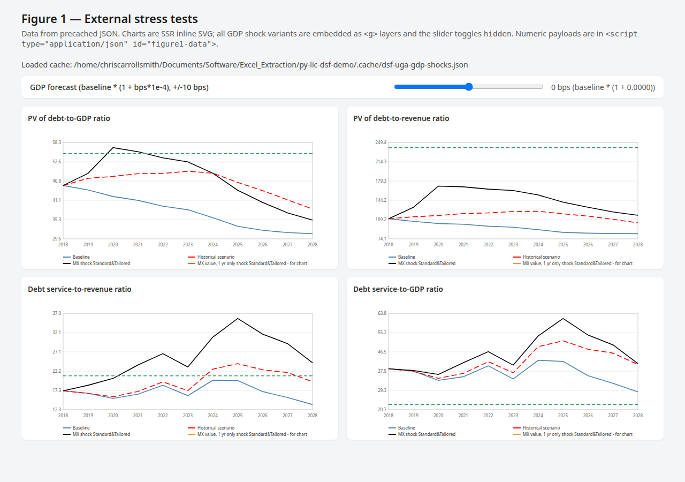

# py-lic-dsf-demo

Precomputed **Figure 1 — external stress** charts from an LIC-DSF-style Excel workbook. A FastAPI app serves static SVG layers and JSON so the GDP shock slider only toggles visibility in the browser (no workbook evaluation per request).

## Prerequisites

- [uv](https://docs.astral.sh/uv/) and Python 3.13+
- A compatible `.xlsm` workbook and dependency graph (see `lic_dsf/graph.py` for defaults and graph cache under `.cache/`, which is gitignored)

## Build the GDP shock cache

From the repo root, with `PYTHONPATH=.` so `lic_dsf` imports resolve:

```bash
PYTHONPATH=. uv run python scripts/precache.py --workbook dsf-uga.xlsm --out .cache/dsf-uga-gdp-shocks.json
```

Common options:

| Flag | Purpose |
|------|---------|
| `--workbook PATH` | Source `.xlsm` (default: workbook path from `lic_dsf.graph`) |
| `--out PATH` | Output JSON (precache default: `.cache/gdp-shocks.json`) |
| `--no-graph-cache` | Rebuild the dependency graph from the workbook instead of a pickle |
| `--libreoffice-check` | Compare Python evaluator output to LibreOffice after caching |

The web app’s default cache path is `.cache/dsf-uga-gdp-shocks.json` unless you override it (see below).

## Run the dashboard

**Option A — `main` entrypoint (recommended for local use)**

```bash
uv run python main.py
```

Optional cache file:

```bash
uv run python main.py --cache .cache/dsf-uga-gdp-shocks.json
```

**Option B — Uvicorn directly**

```bash
GDP_SHOCK_CACHE=.cache/dsf-uga-gdp-shocks.json uv run uvicorn main:app --host 127.0.0.1 --port 8000 --reload
```

Environment variables (used when `--cache` is not set and you are not using `python main.py`):

- `GDP_SHOCK_CACHE` — path to the precache JSON (alias: `FIGURE1_SHOCK_CACHE`)

Then open [http://127.0.0.1:8000/](http://127.0.0.1:8000/).

**API**

- `GET /api/figure1-data` — slim JSON for the slider and charts (or `503` with an `error` field if the cache is missing or invalid)

## Screenshot

Dashboard with a populated cache:



## Regenerate the screenshot

One-time browser install for the dev toolchain:

```bash
uv sync --group dev
uv run playwright install chromium
```

Capture `docs/dashboard.png` (requires an existing cache file):

```bash
uv run python scripts/screenshot_dashboard.py --cache .cache/dsf-uga-gdp-shocks.json
```

Use `--out` to write a different path.
